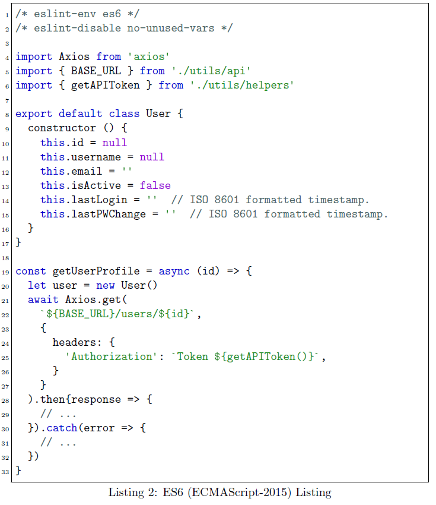

# LaTeX Listings &mdash; JavaScript & ES6

The LaTeX [listings](https://ctan.org/pkg/listings?lang=en) package does not include (by default) a language specification for JavaScript/ECMAScript.  However, the package provides the capability to create custom languages and styles based on built-in methods.  These methods were used to create listings languages for JavaScript and ES6 (ECMAScript 2015).

# Basic JavaScript

First, the JavaScript version 1.1 definition is built in a way to allow for modifications to be built upon the basic language.  Reference the [JavaScript v1.1 specification](http://hepunx.rl.ac.uk/~adye/jsspec11/titlepg2.htm).

## The code
```latex
\lstdefinelanguage{JavaScript}{
  morekeywords=[1]{break, continue, delete, else, for, function, if, in,
    new, return, this, typeof, var, void, while, with},
  % Literals, primitive types, and reference types.
  morekeywords=[2]{false, null, true, boolean, number, undefined,
    Array, Boolean, Date, Math, Number, String, Object},
  % Built-ins.
  morekeywords=[3]{eval, parseInt, parseFloat, escape, unescape},
  sensitive,
  morecomment=[s]{/*}{*/},
  morecomment=[l]//,
  morecomment=[s]{/**}{*/}, % JavaDoc style comments
  morestring=[b]',
  morestring=[b]"
}[keywords, comments, strings]
```

## Example

### Markup

```tex
\begin{lstlisting}[style=JavaScript, caption={JavaScript Listing}]
(function () {
  var user = getCookie("username");
  document.getElementById("#date-field").innerHTML = new Date();
  document.getElementById("#greetings").innerHTML =
    "<p>Hello, " + user.name + ".</p>";
})()

function getCookie(cname) {
  var name = cname + "=";
  var decodedCookie = decodeURIComponent(document.cookie);
  var ca = decodedCookie.split(';');
  for(var i = 0; i < ca.length; ++i) {
    var c = ca[i];
    while (c.charAt(0) == ' ') {
      c = c.substring(1);
    }
    if (c.indexOf(name) == 0) {
      return c.substring(name.length, c.length);
    }
  }
  return "";
}
\end{lstlisting}
```

### Resulting Typeset


# ECMAScript 2015 (ES6)

ES6 adds additional keywords and interpolated string capability.  So these need to be reflected in the language defintion for `listings`.  The `ECMAScript2015` dialect of the `JavaScript` language uses the base language and adds the additional keywords and string interpolation.

There is an alias to map the language `ES6` to the `ECMAScript2015` dialect such that `language=ES6` is the same as `language=[ECMAScript2015]JavaScript`.

```tex
\lstalias[]{ES6}[ECMAScript2015]{JavaScript}
```

## The code
```latex
\lstdefinelanguage[ECMAScript2015]{JavaScript}[]{JavaScript}{
  morekeywords=[1]{await, async, case, catch, class, const, default, do,
    enum, export, extends, finally, from, implements, import, instanceof,
    let, static, super, switch, throw, try},
  morestring=[b]` % Interpolation strings.
}
```

## Example

### Markup
```tex
\begin{lstlisting}[style=ES6, caption={ES6 (ECMAScript-2015) Listing}]
/* eslint-env es6 */
/* eslint-disable no-unused-vars */

import Axios from 'axios'
import { BASE_URL } from './utils/api'
import { getAPIToken } from './utils/helpers'

export default class User {
  constructor () {
    this.id = null
    this.username = null
    this.email = ''
    this.isActive = false
    this.lastLogin = ''  // ISO 8601 formatted timestamp.
    this.lastPWChange = ''  // ISO 8601 formatted timestamp.
  }
}

const getUserProfile = async (id) => {
  let user = new User()
  await Axios.get(
    `${BASE_URL}/users/${id}`,
    {
      headers: {
        'Authorization': `Token ${getAPIToken()}`,
      }
    }
  ).then{response => {
    // ...
  }).catch(error => {
    // ...
  })
}
\end{lstlisting}
```

### Resulting Typeset


# Styling the language
The `listings` package also has the built-in capacity for custom styling the language definitions.  The styles presented in the typeset images were generated using:

```tex
% Requires package: color.
\definecolor{mediumgray}{rgb}{0.3, 0.4, 0.4}
\definecolor{mediumblue}{rgb}{0.0, 0.0, 0.8}
\definecolor{forestgreen}{rgb}{0.13, 0.55, 0.13}
\definecolor{darkviolet}{rgb}{0.58, 0.0, 0.83}
\definecolor{royalblue}{rgb}{0.25, 0.41, 0.88}
\definecolor{crimson}{rgb}{0.86, 0.8, 0.24}

\lstdefinestyle{JSES6Base}{
  backgroundcolor=\color{white},
  basicstyle=\ttfamily,
  breakatwhitespace=false,
  breaklines=false,
  captionpos=b,
  columns=fullflexible,
  commentstyle=\color{mediumgray}\upshape,
  emph={},
  emphstyle=\color{crimson},
  extendedchars=true,  % requires inputenc
  fontadjust=true,
  frame=single,
  identifierstyle=\color{black},
  keepspaces=true,
  keywordstyle=\color{mediumblue},
  keywordstyle={[2]\color{darkviolet}},
  keywordstyle={[3]\color{royalblue}},
  numbers=left,
  numbersep=5pt,
  numberstyle=\tiny\color{black},
  rulecolor=\color{black},
  showlines=true,
  showspaces=false,
  showstringspaces=false,
  showtabs=false,
  stringstyle=\color{forestgreen},
  tabsize=2,
  title=\lstname,
  upquote=true  % requires textcomp
}

\lstdefinestyle{JavaScript}{
  language=JavaScript,
  style=JSES6Base
}
\lstdefinestyle{ES6}{
  language=ES6,
  style=JSES6Base
}
```